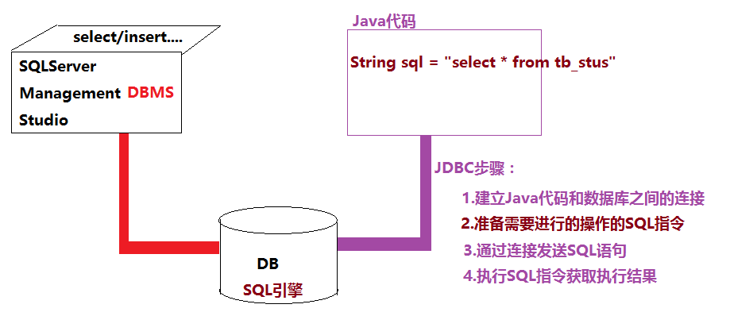
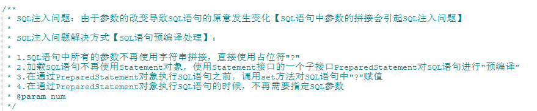
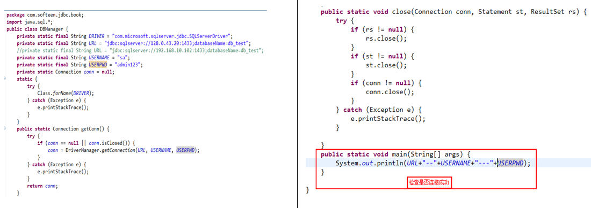
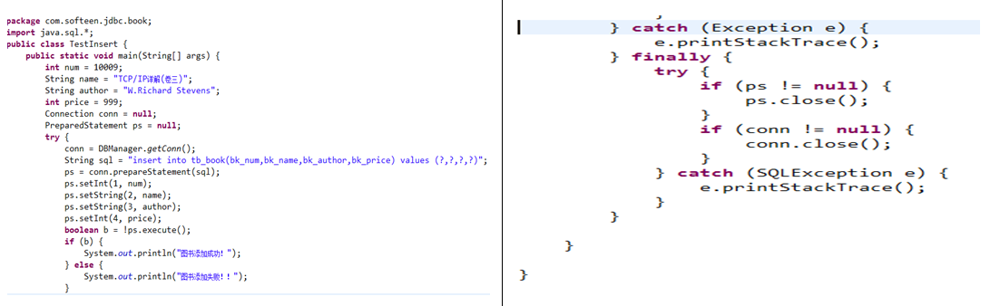
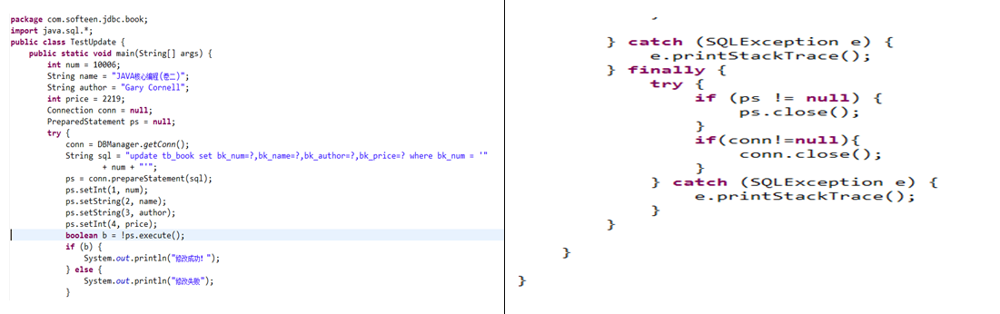
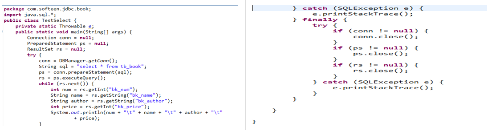
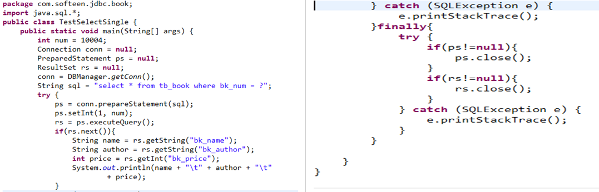
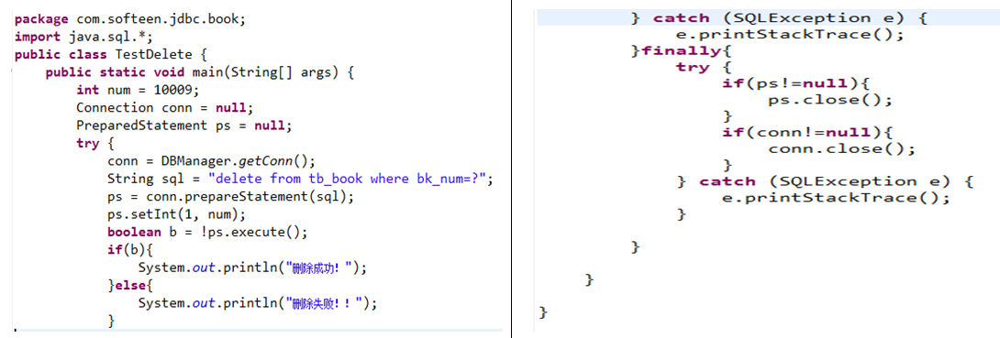

# JDBC简介

**JDBC(Java DataBase Connection)Java数据库连接**，可以通过Java语言连接到数据库（SQLServer/MySQL/Oracle…），从而完成数据的持久化处理。

SQL指令（DML，DDL，存储过程，触发器，函数，程序包）

JDBC可以将Java程序中的数据通过代码保存到数据库。

# Statement接口

**Statement st = conn.createStatement();**

Statement接口是用来对要执行的sql语句进行加载、解析/编译，并可以通过此对象调用:

- boolean execute(sql)  **对于增删改(insert/delete/update)**调用此方法，返回**false**表示执行成功

- int executeUpdate(sql)  **对于增删改(insert/delete/update)**调用此方法，返回的整数表示影响的记录的行数

- ResultSet executeQuery(sql) **对于查询（select）** 调用此方法，查询的数据存放在返回的ResultSet对象中执行SQL指令。

** **

# ResultSet接口

此接口用于封装从数据库查询的结果集。一个ResultSet对象就表示一条查询语句查询的结果，相当于一个集合。

# PreparedStatement接口

PreparedStatement接口是Statement的子接口。

对SQL语句进行预处理，解决SQL语句字符串拼接带来的SQL注入问题。

​     ps = conn.prepareStatement(sql);

设置SQL语句中的参数：

​     ps.setString(index,value);

​	ps.setInt (index,value);

​	ps.setFloat (index,value);

​	ps.setDate (index,value);

​	执行SQL语句：

# 图书的增删改查

---

---

---

---

---

