# HTML标签（功能标签）

- 显示标签：将文本、图片、声音和视频展示给用户

- 输入标签：给用户提供输入视图，用于输入数据

- 功能标签：没有视图效果，完成某种特定的功能

## 超链接

作用：当点击特定的本文/图片提示，可以**跳转**到指定的位置

1.跳转到指定的其他的页面

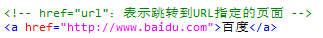

2.跳转到当前页面中的某个位置

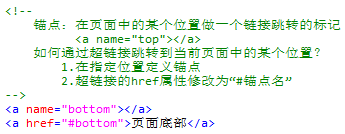

3.设置超链接的各种样式


## 表单

作用：用于提交用户输入的数据

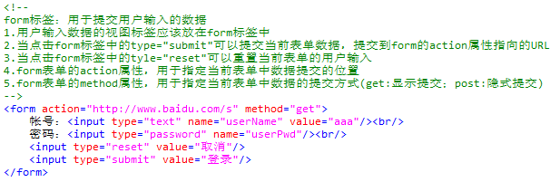

# HTML标签（布局标签）

布局标签，就是对显示标签、输入标签进行排版，从让页面美观一些。

## 换行标签

```html
<br/>
```

## 文本布局

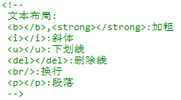

## 水平分割线

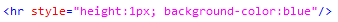

## 字段域

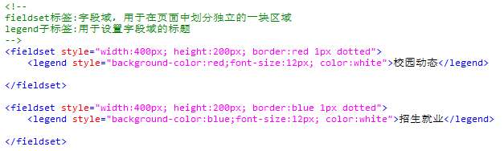

## DIV层

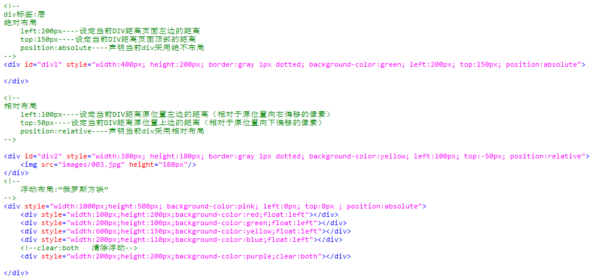

## header标签

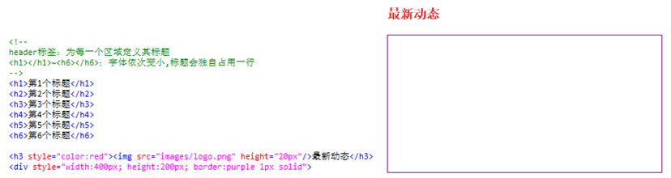

## 列表标签

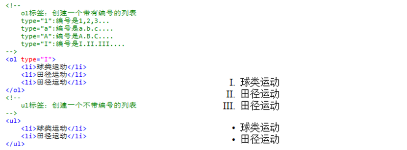

## 表格

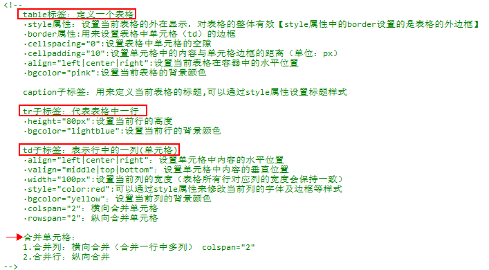

# 页面框架

## frameset标签

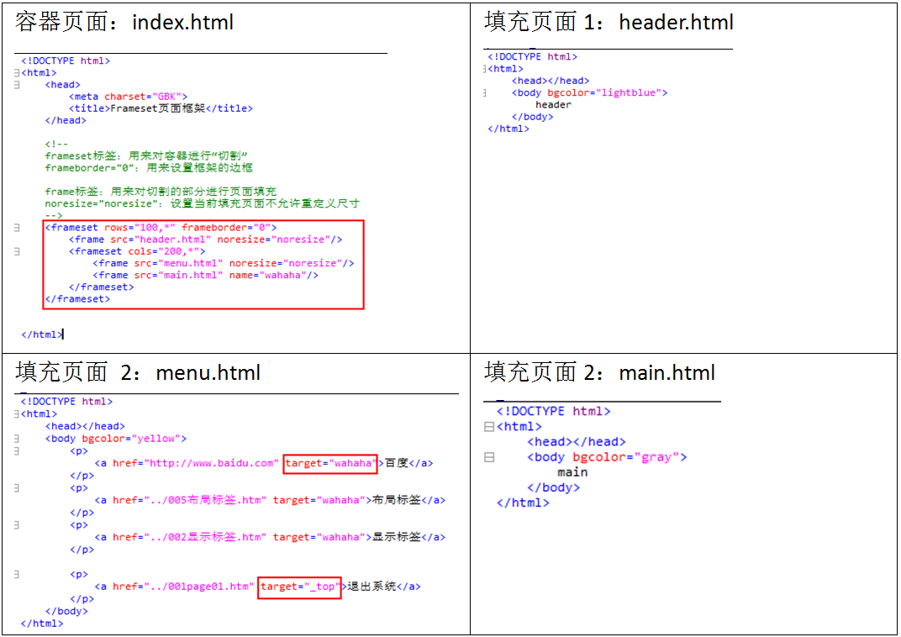

## iframe标签

- div+iframe

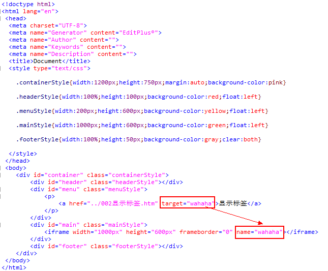

- table+iframe

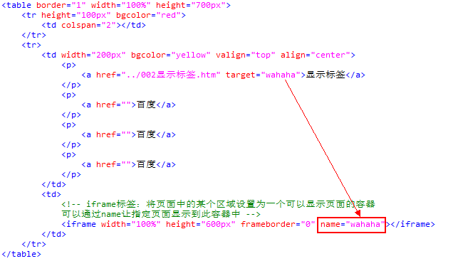

