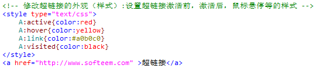

# HTML标签（功能标签）

- 显示标签：将文本、图片、声音和视频展示给用户

- 输入标签：给用户提供输入视图，用于输入数据

- 功能标签：没有视图效果，完成某种特定的功能

## 超链接

作用：当点击特定的本文/图片提示，可以**跳转**到指定的位置

1.跳转到指定的其他的页面


2.跳转到当前页面中的某个位置


3.设置超链接的各种样式



## 表单

作用：用于提交用户输入的数据


# HTML标签（布局标签）

布局标签，就是对显示标签、输入标签进行排版，从让页面美观一些。

## 换行标签

```html
<br/>
```

## 文本布局


## 水平分割线


## 字段域


## DIV层


## header标签


## 列表标签


## 表格


# 页面框架

## frameset标签


## iframe标签

- div+iframe


- table+iframe


