# 一、其他常用的一些HTML标记

##          **文本**  

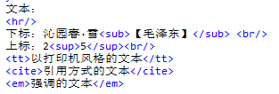

##          多媒体  

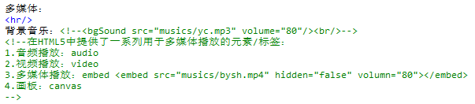

##          地图

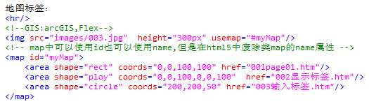

##          布局 


##          特殊符号

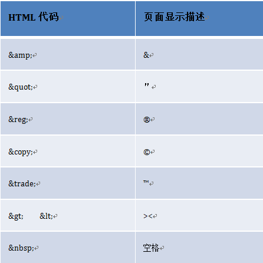

# 二、CSS简介

## 1.为什么使用CSS？
​	如果想要修改HTML视图的样式，我们可以在标签中添加style属性来完成，但是如果直接在style属性中完成：
​		1.每个标签都需要添加style，如果效果相同，style属性值是重复的页面繁琐
​		2.如果样式需要统一修改，则每个style属性值都需要修改维护麻烦
​	为了解决在标签中直接添加style造成的页面繁琐及维护麻烦的问题，我们引入了CSS层叠样式表
## 2.什么是CSS？
​	CSS层叠样式表，指的是将页面视图需要的样式直接定义在<style type="text/css"></style>标签中，在HTML元素可以直接套用。
## 3.CSS基本语法？
​	selector{attr1:value1 ; attr2:value2….}

- CSS样式表定义在style标签中
- 选择器{attr1:value1 ; attr2:value2 ....}
- 属性名和属性值之间用冒号隔开，多个属性之间用分号隔开
- 如果属性值是由多个单词构成，则需要将属性值放在""中

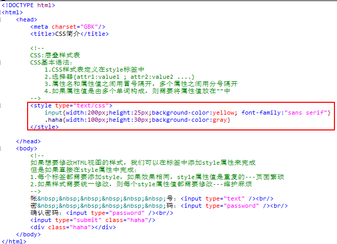

# 三、CSS选择器

## 1.简单选择器（单选择器）：

- 标签选择器：根据标签的名字选择页面中的元素

  

- class选择器：根据class属性的值来选择页面中的元素

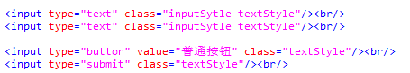

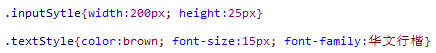

- id选择器：根据id属性值来选择页面中的元素

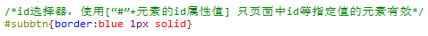

## 2.复合选择器（多选择器）：

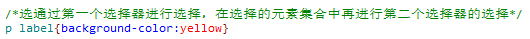

# 四、CSS常见样式

## 1.：字体样式：

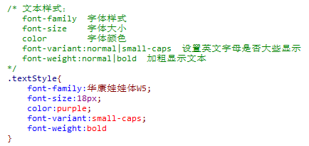

## 2.文本样式：

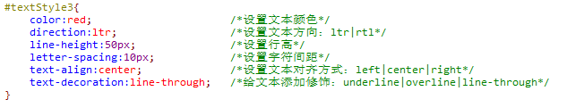

## 3.背景样式：

一般用于设置区域标签（body,div,fieldset,table,h1~h6,label…）的背景

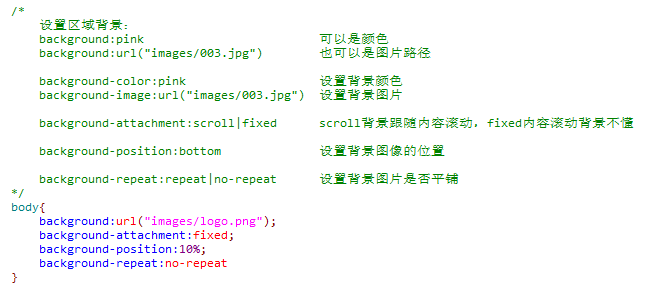

## 4.边框样式：

也是用于区域标签设置（div,table,input,fieldset…）

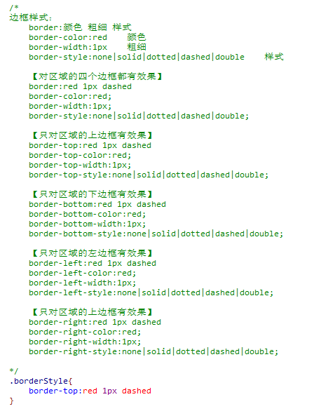

## 5.间距：

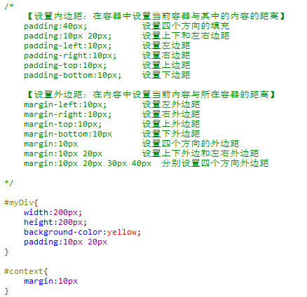

## 6.超链接样式：

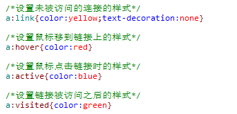

# 五、HTML标签样式的定义规则

```html


<input type="text" style="width:200px"/>
```

1.通过标签属性设置标签显示效果

2.通过标签中的style属性设置样式

3.通过CSS样式表设置样式

4.通过CSS文件定义样式，让后在网页文件中引用

优先级：style属性设置 > CSS样式表 > CSS文件定义 > 属性