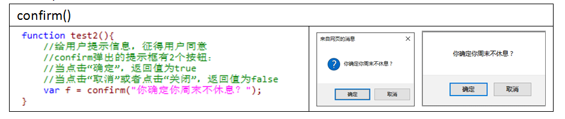

# JS介绍

## 1.JavaScript作用

HTML：网页制作，可以在网页中展示视图
CSS：层叠样式表，美化HTML标签视图的显示效果
如果单纯的使用HTML和CSS来完成页面的设计，这样的页面称之为静态页面：不能实现用户和页面之间的交互，页面效果显示比较单一。
JavaScript：

- 实现页面和用户之间的数据交互；
- 动态改变页面的显示效果；
- 页面和后台代码的交互。

## 2.JavaScript是什么？

JavaScript是一种**基于对象**的**事件驱动**的解释型**脚本语言**

​     脚本语言：JS必须依赖于页面在客户端的浏览器中运行（代码必须写在HTML网页中）。

​     基于对象：1.对象是通过构造器产生；2.可以为对象随时的附加属性。

​     事件驱动：JS方法不能独立的执行，必须依赖于对页面中的某个动作来触发执行。

​     解释型：JS代码是通过解释执行的。

## 3.JavaScript与Java的区别：

|          | **JavaScript**       | **Java**               |
| -------- | -------------------- | ---------------------- |
| 公司     | Netscape             | Sun                    |
| 语言类型 | 基于对象             | 面向对象               |
| 执行过程 | 解释型               | 编译解释性             |
| 数据类型 | 弱类型               | 强类型                 |
| 嵌入方式 | 页面的脚本语言       | 服务器编程语言         |
| 代码风格 | function method (){} | public void method(){} |

## 4.JavaScript工作流程：

## 5.JavaScript可以作甚？
​	JS可以：
​		①与用户进行动态交互，动态改变视图的效果
​		②可以对用户在网页中输入的数据进行检查（校验）
​		③可以动态的在当前网页添加或者删除HTML标签
​		④可以操作当前网页的cookie（网页的缓存信息）
​	JS不可以：
​		①不能读取/修改用户的本地文件
​		②不能启动客户端的应用程序
​		③不能关闭不是由它打开的窗口
​		④不能实现来自于不同服务器的网页信息的交互

# 第一个JS程序

## 1.JavaScript代码写在哪里？

- JS代码要定义在网页中的标签中

  【4.0以前的规范：】

- script标签可以写在网页中的任何位置，但是一般写在head标签中

- 在一个页面中可以有多个script标签

- S代码也可以写在后缀名为”.js”的脚本文件中，然后可以在网页中通过如下引用：

## 2.JavaScript中的注释如何写？

同Java

## 	3.第一个JS程序：

## 4.JS程序中的弹出框（对话框）

可以将JS程序中的数据，以弹出框的形式展现出来（相当于Java程序中的输出语句）

- 警告框：当用户出现较为严重错误时提示警告信息，一般情况下慎用

- 提示框/信息确认提示框：用于给用户一些提示信息，或者征求用户的同意。

- 提示输入框：提供一个弹出框，弹出框中可以输入信息

## 5.关闭当前浏览器窗口：

​     window.close();

​     1. IE弹出提示框，然后根据用户选择决定是否关闭本窗口

​      火狐浏览器不兼容此操作

​      谷歌浏览器不提示，直接关闭当前窗口

​     2.如果JS代码只有一句，可以不单独定义一个方法， 可以直接通过如下形式执行：

# JS基本语法

关键字、运算符、流程控制、异常处理…

# JavaScript内置对象

JavaScript是一种基于对象的语言（在JS中没有类的概念，只有对象的概念）
对象是直接通过构造器产生的，构造器就是用来产生对象的。
JavaScript内置对象其实就相当于Java类库中的类，是已经定义、已经存在的。
11个JS的内置对象：

## 1.Array对象：

- 使用

- 属性和方法

## 2.String对象：

## 3.RegExp对象：

## 4.Math对象：

## 5.Date对象：

一个Date对象表示一个具体的时间(日期+时间)

## 6.全局对象：

JS中可以直接访问的对象，全局对象提供的方法可以在JS方法中直接调用，无需使用“Global.”调用

