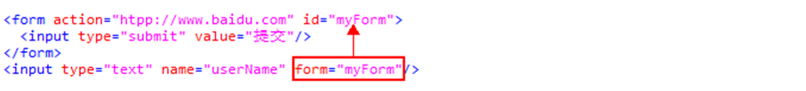
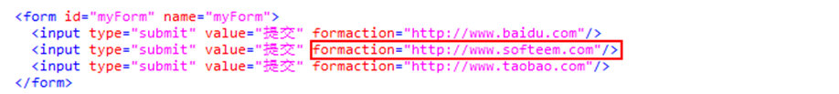
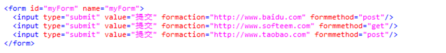
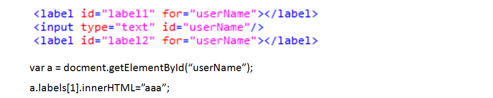
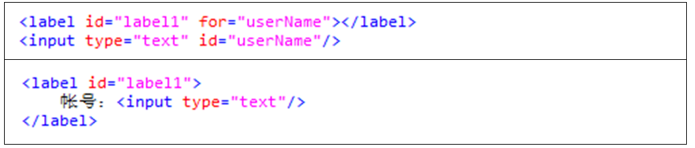
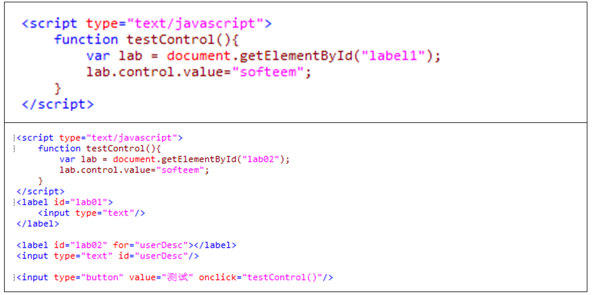
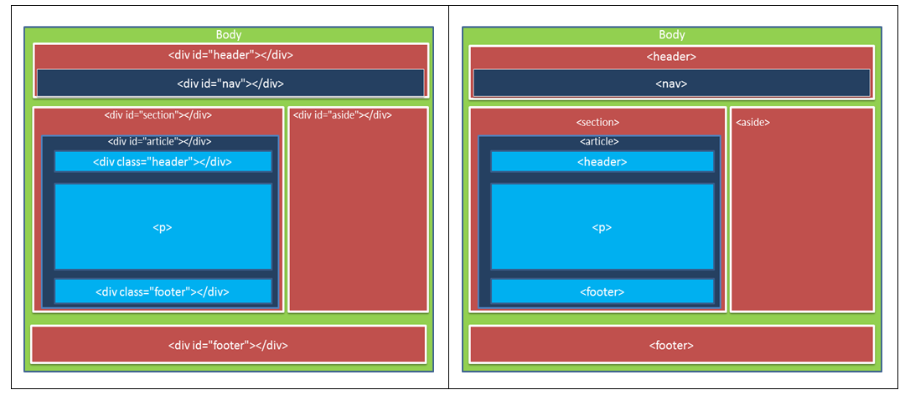

# 1.	HTML5新增与废除的元素

## 新增的元素：

a.    新增的表单元素： email、url、number、range、DatePickers、datalist

b.    新增的语义化（结构）元素：section、article、aside、header、hgroup、footer、nav、figure

c.    新增的多媒体元素：video、audio、embed、cavnas

d.    其他：mark、progress、meter、time、ruby、rt、rp、wbr、command、datagrid、keygen、output、source、menu等

## 废除的元素：

a.    能使用CSS代替的元素：basefont、big、center、font、s、tt、u等

b.    不再使用frameset框架（我们之前讲过的frameset及iframe）

c.    只有部分浏览器支持的元素

# 2.	HTML5新增与废除的属性

## 新增的属性：

a.    表单相关的属性

b.    链接相关的属性

c.    其他属性

## 废除的属性：

a.    contentEditable属性

b.    designMode属性

c.    hidden属性

d.    spellcheck属性

e.    tabindex属性

# 3.	HTML5表单新增元素与属性-1

## a.表单内元素的form属性：

在HTML4中，表单内的从属元素标签必须写在form表单内部，而在HTML5中，可以将输入标签写在页面上的任何地方，只需在标签元素添加form属性即可，属性值为所属表单的id的值。



## b.提交按钮的formaction属性：

在HTML4中，表单只能通过action属性来指定数据提交的页面；HTML5中可以通过为多个提交按钮添加不同的formaction属性，从而实现点击不同按钮提交到不同的页面。



## c.提交按钮的formmethod属性：



## d.提交按钮的formtarget属性：

​          此属性相当于form标签的target属性，用于指定提交页面打开的位置。取值可以是（_blank,_self,_parent,_top,framename）

## e.信息输入框的formenctype属性
- text/plain：空格转换为＋，不对特殊字符进行编码
- multipart/form-data：不对字符进行编码，文件上传时必须使用这个值
- application/x-www-form-urlencoded：对所有字符进行编码

## f.autofocus属性：

为文本框、选择框或者按钮标签加上autofocus属性，当画面打开时，该控件可以自动获取光标焦点。

## g.required属性：

几乎可以为所有的表单输入标签添加required属性，提示必须输入信息。

## h.labels属性：

这是一个JavaScript属性，可以获取一个标签的对应的label（返回的是一个数组）。



# 4.HTML5表单新增元素与属性-2

- a.label标签的control属性：

这也是一个JavaScript属性，我们可以在标签label内部放置一个输入标签，如下：



在JS中可以的使用如下：



- b.文本输入框的placeholder属性
- c.文本输入框的list属性
- d.文本输入框的autocomplete属性
- f.文本输入框的pattern属性
- g.文本输入框的selectionDirection属性：JS属性，获取输入框中文字的选择方向（forward/backward）
- h.复选框的indeterminate属性：
- i.image按钮的height和width属性

# 5.HTML5新增表单标签：

- <input type="date"> 		日期设置 
- <input type="datetime-local"> 	日期时间设置 
- <input type="week">		年中周数选择 
- <input type=“time “>		时间设置 
- <input type=“month “> 		月份选择 
- <input type="email"> 		邮箱地址 
- <input type=“number  “>		数值设置 
- <input type=“range “>		范围设置 
- <input type=“url “>			URL地址 

**Datalist**     **新的列表构建方式** 

```
<input id="myCar" list="cars" type="text" /> 

<datalist id="cars"> 

 <option value="BMW"> 

 <option value="Ford"> 

 <option value="Volvo"> 

</datalist> 
```

# 6.HTML5新增语义化标签：

```
<article>	 标记定义一篇文章
<header>	 标记定义一个页面或一个区域的头部
<nav> 	标记定义导航链接
<section>	 标记定义一个区域
<aside> 	 标记定义页面内容部分的侧边栏
<hgroup>	 标记定义文件中一个区块的相关信息
<figure> 	 标记定义一组媒体内容以及它们的标题	
<figcaption>	 标签定义 figure 元素的标题。
<footer> 	 标记定义一个页面或一个区域的底部
<dialog>	 标记定义一个对话框(会话框)类似微信
```



## article标签：
​	article元素代表文档、页面或者应用程序中独立的、完整的、可以独自被外部引用的内容。article元素可以嵌套使用。
## section标签：
​	section元素用于对网站或者应用程序中页面上的内容进行分块。一个section元素通常由内容及其标题组成。但是section元素并不是一个普通的容器元素，如果需要直接定义样式或者通过脚本定义行为时，推荐使用div元素。
## nav标签：
​	nav元素是一个可以用作页面导航的连接组，其中的导航元素链接到其他页面或者当前页面的其他位置。nav元素可以应用于传统导航条、侧边栏导航、页内导航和翻页操作等。

## header标签：
​	header是一种具有引导和导航作用的结构元素，通常用来放置整个页面或者页面中一个区域的标题。
## footer标签：
​	footer可以作为其上层区域或是整个页面的脚注。
## hgroup标签：
​	hgroup是用来对标题（h1~h6）元素进行分组。
## address标签：
​	address用来在文档中展示和文档作者或者文档维护者的联系信息。

