# Servlet介绍

## 1.为什么需要Servlet?

JSP执行过程：

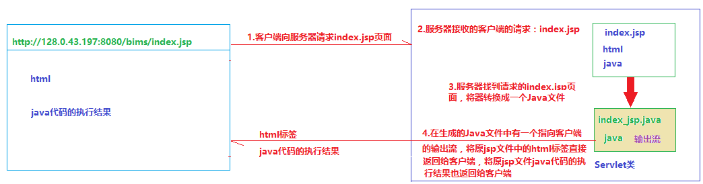

如果一个JSP页面中只有java代码，我们可以直接将Java代码写在一个类（java文件）中，这样就省掉了将JSP转换成java文件的过程。但是这个类必须要和JSP一样能够接受客户端的请求的Servlet类。

## 2.Servlet类的特点：

- 可以接收页面的请求

- 能够响应客户端

# Servlet创建及配置

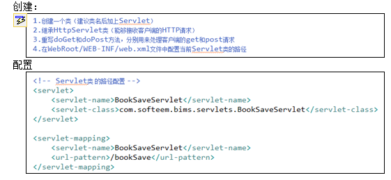

# Servlet web元素

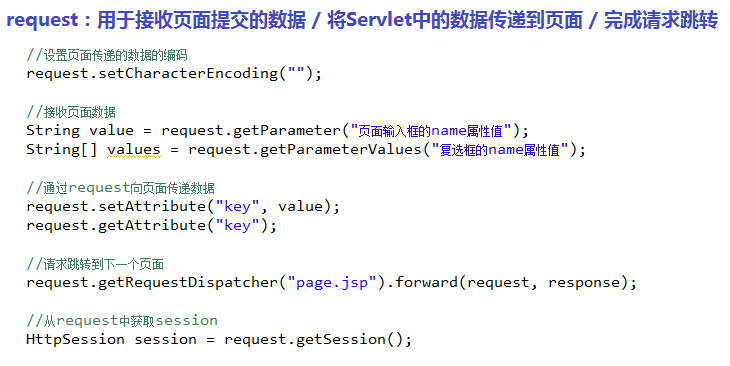

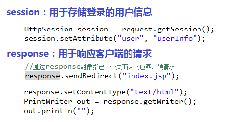

# web项目的欢迎页面

在webRoot/WEB-INF/web.xm l修改欢迎页面

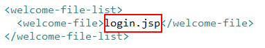

# 如何将页面的数据提交到指定的servlet类？

​     a.可以通过URL提交

​     b.可以通过form表单的action属性提交

​          修改表单的属性值为对应类的映射路径（配置）

# 如何在Servlet中接收页面提交的数据？

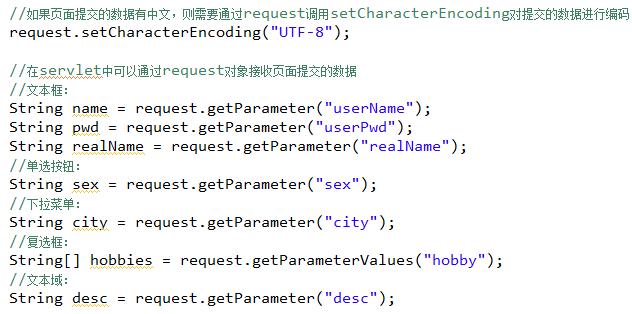

# 如何从Servlet类传值到下一个页面？

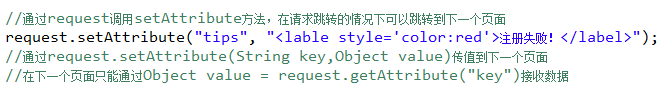

#          如何从Servlet类跳转到下一个页面  

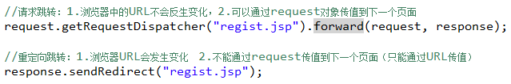

#          如何在JSP页面接收Servlet传递的数据？  

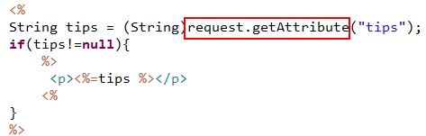

# 如何对用户登录进行验证（未登录用户不能访问主页面）？

- 一旦用户登录成功，就将用户信息存放到session

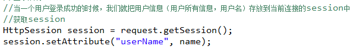

- b.在用户未登录不允许访问的页面中，验证session

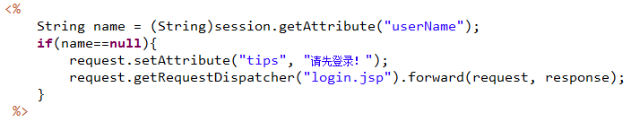