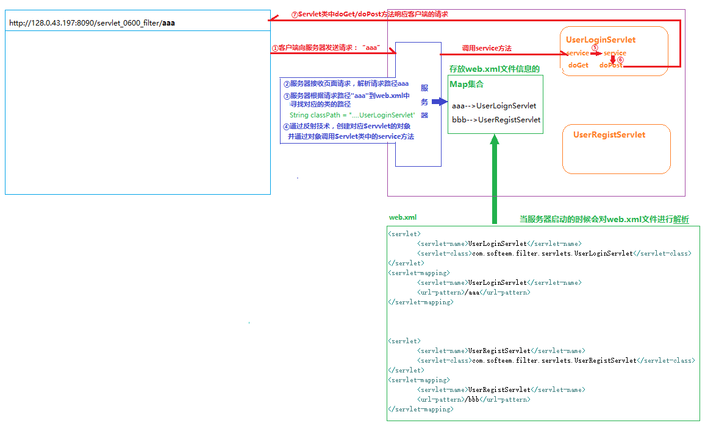
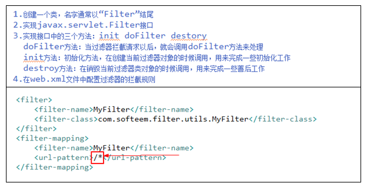
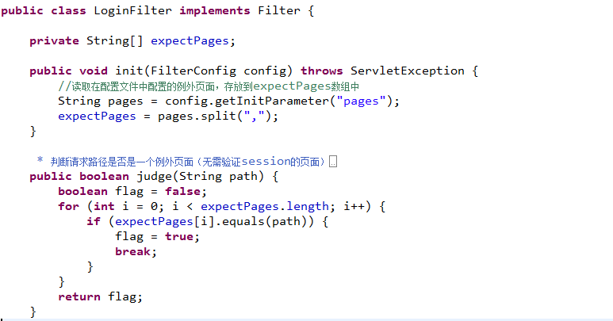
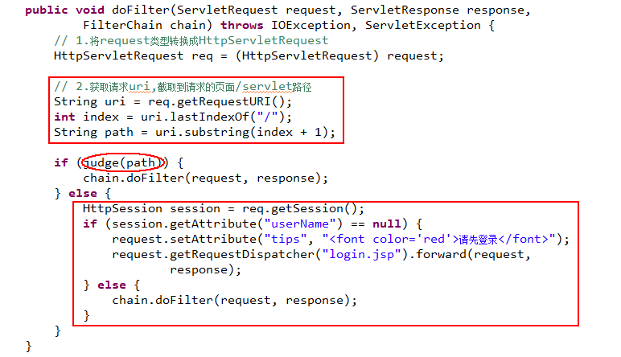
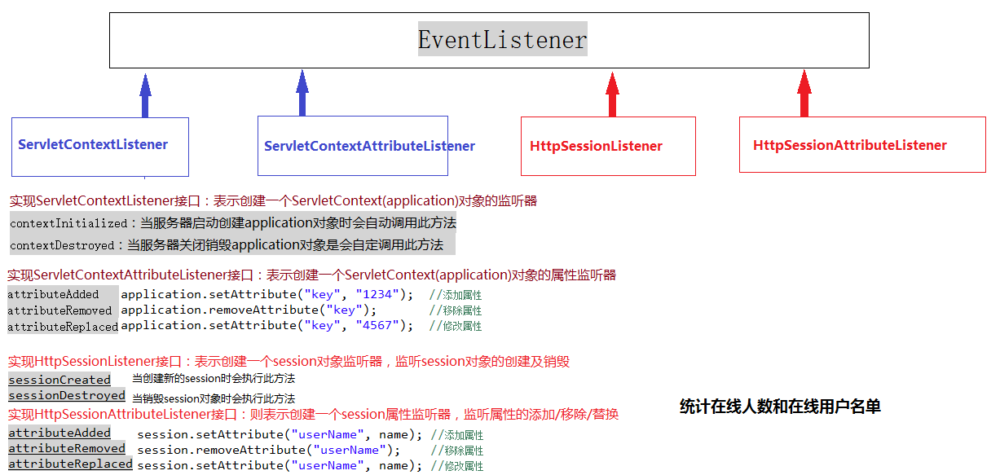
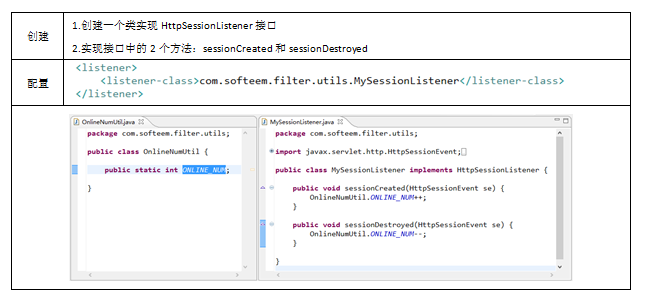
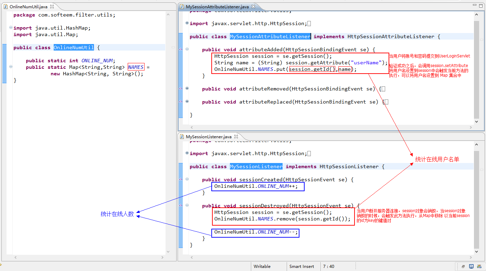
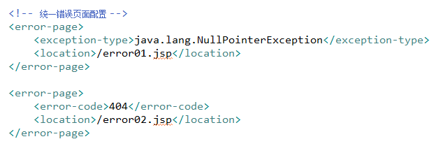
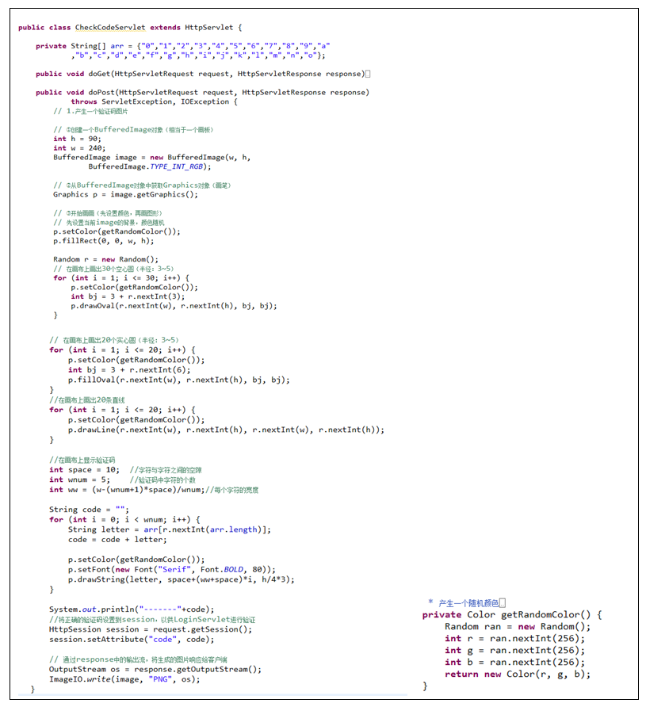
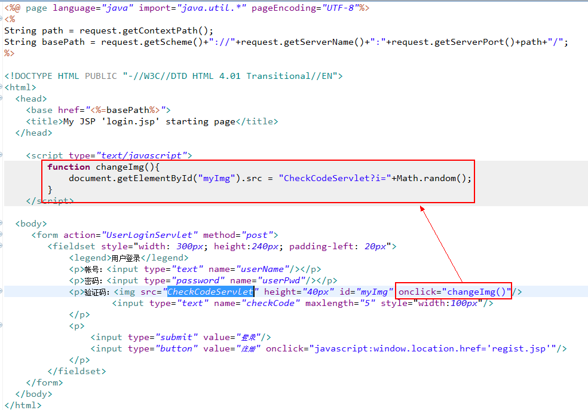

# Servlet类的请求和响应过程

# Servlet过滤器

## 什么是过滤器：
​	过滤器就是一个可以拦截用户请求的类，可以对用户的请求进行解析处理，如果用户请求满足某种规则，就“允许通行”;如果不满足规则，可以“阻止通行”。

## 过滤器的创建和配置：

## 过滤器实用案例【登录验证】

# 统一编码过滤器：

# session监听器

监听器就是一个可以监视某个”动作”类.一旦这个类所监视的动作发生了，就会执行这个类中的某个方法。

## 监听器的创建和配置：

### 1、session对象监听器

### 2、session属性监听器（实现HttpSessionAttributeListener接口）

# 统一错误页面

# 验证码

