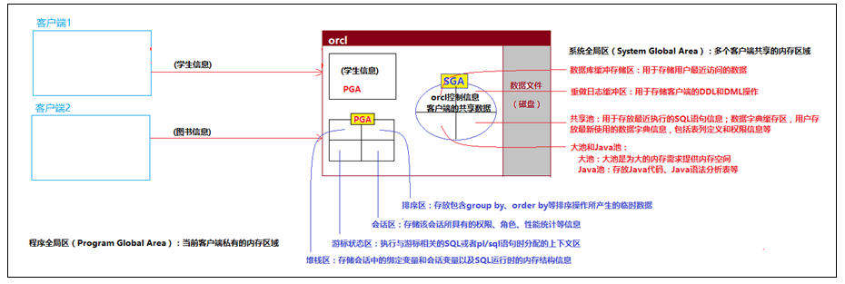
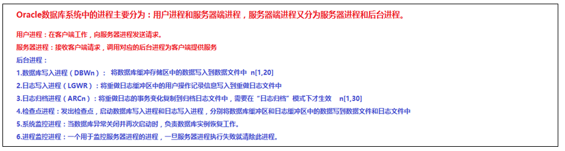
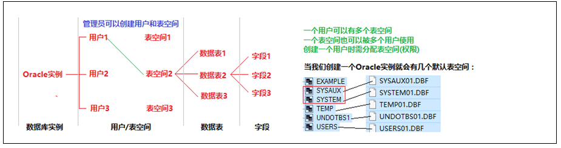
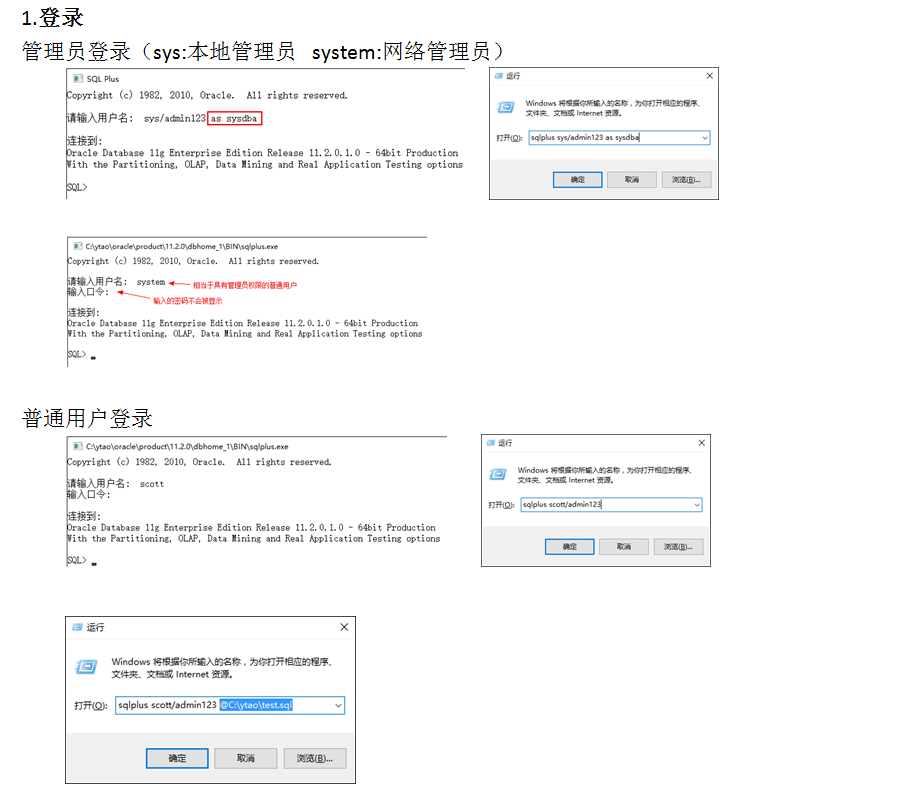
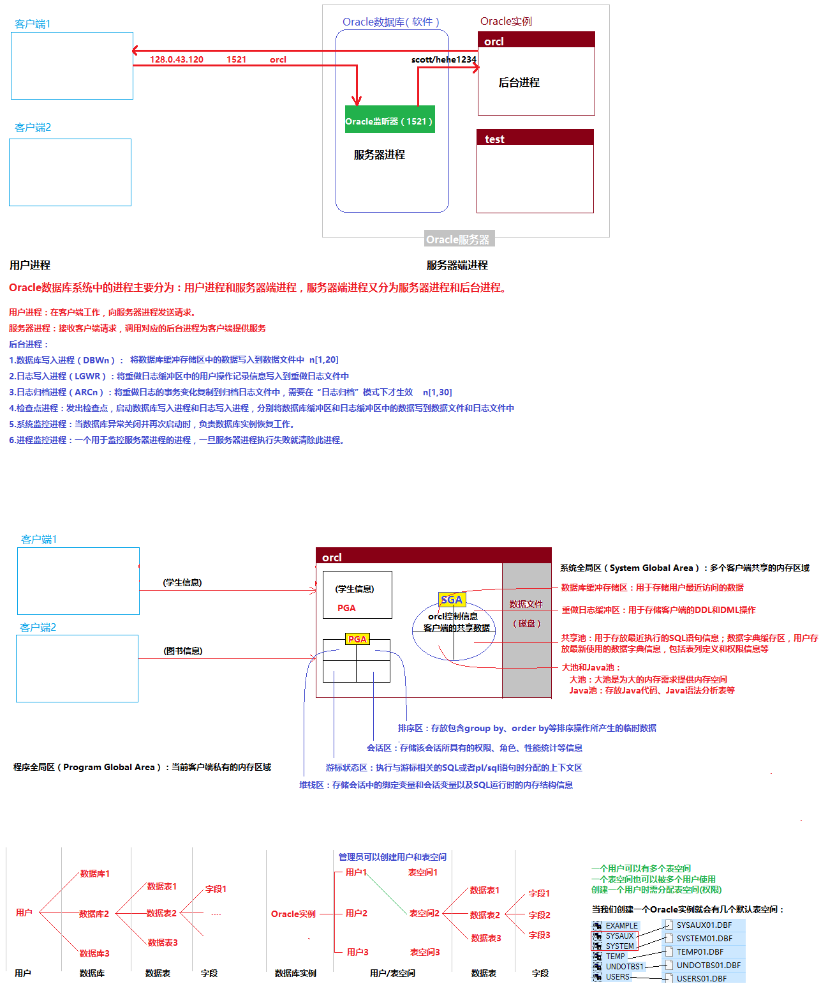

# Oracle的体系结构

## 内存结构：

保存到数据库中的数据是保存在磁盘（文件）中，但是当我们进行CRUD操作的时候，这些数据会先保存在内存中，可以提高数据库处理数据的效率。



## 进程结构：



## 文件结构（物理结构）：

Oracle数据库是一个文件系统数据库，我们的数据是存储在Oracle实例对应的文件中


## 逻辑结构：



# Oracle客户端工具

SQLPlus

isqlplus(10g提供的web项目，5560)

PLSQL Developer

Navicat for Oracle

em(web项目，1158)

OEM（需要下载安装使用）

## SQLPlus工具：



## SQL\*Plus常用命令：

在SQLPlus工具中，除了可以使用SQL指令外，还能使用SQLPlus指令

SQL*Plus可以处理两类命令：SQL命令和SQL*Plus命令（都不区分大小写）

SQL命令只要用来对数据库进行操作，不可以简写，还要以”/”开始运行，以”;”结束，SQL命令存放于SQL缓冲区中，可以调出进行编辑，也可以被反复运行；SQL*Plus命令主要用来设置查询结果的显示格式，设置一些环境选项和提供帮助信息等，可以简写，不必输入”;”结束，SQL*Plus不被保存在缓冲区中。

- 连接与断开数据库连接：connect(conn)和disconnect(disconn)

  格式：conn/connect 用户名/口令@主机字符串
  			conn scott/root@orcl 以普通身份连接到数据库
  			conn scott/root@orcl as sysbda 以数据库管理员身份连接数据库，都被视为SYS用户，此时用户名和密码可以省略
  			show user 可以用来查看当前用户名
  			disconn 命令用于断开连接

- 查看表结构：describe(desc)
  	格式： describe/desc 表名
  	该命令也用于查看视图、同义词的结构

- SQL*Plus会话环境设置：set
  	格式：set 环境变量名 值
  	比较重要的环境变量有：arraysize、linesize、pagesize、pause、autocommit 
  	arraysize：表示一次提取的记录的行数，取值范围1-5000，默认15
  	linesize、pageSize：表示显示行的宽度和一页显示的记录数
      pause：用于控制屏幕显示，当设置为on时，在发出select语句后需要按Enter键才会显示下一屏
      autocommit：set auto[commit] {OFF/ON/IMM/N} 
      OFF/ON/IMM/N表示“不自动提交/自动提交/立即提交/将上次commit后的N条语句一起提交”。

- SPOOL（假脱机）命令：用于转储SQL执行的命令及结果，也可用于转出数据库系统中的数据。

  例如：将表emp数据转出到d:\emp.txt中
  	spool d:\emp.txt
  	prompt 每页显示五行，每行显示80个字符
  	set pagesize 5
  	set linesize 80
  	select * from emp;
  	spool end

- 编辑命令:都是正对SQL缓冲区中sql的操作
  例如，原缓冲区中的数据[select * from emp]
  	change(c)/emp/dept  执行这条语句就表示把缓冲区中的emp换成dept，则缓冲区中的语句就是[select * from dept]
  list  表示查看缓冲区中的内容
  append  where 1=1  表示将‘ where 1=1’拼接在缓冲区原有数据的后面，则缓冲区中的语句就是

  [select * from dept where 1=1]
  	edit 表示用文本编辑器编辑缓冲区中的内容

  - 执行SQL缓冲区中语句命令
    			格式：/和run
  - 执行SQL脚本文件命令
    			格式1：start SQL文件名
    			格式2：@SQL文件名
  - 执行存储过程命令：execute
    			execute 存储过程名
  - 设置列显示属性：column（col）
    			col name FORMAT A10 表示设置name的显示格式为10个字符宽度
  - SHOW：用于查看用户、数据库实例、系统变量等的值
    			show user  查看当前会话的连接用户
    			show parameters db_name 查看当前用户连接到的数据库
  - 显示命令帮助信息：help	
    			格式：help [命令名]
    			help show  表示查看show命令的帮助

# Oracle用户角色及权限管理

```sql
--用户操作：
--1.创建用户,同时为其分配表空间（当前用户创建的表就在指定的表空间中）
create user zhangsan 
identified by admin123
default tablespace users
temporary tablespace temp;

--如果创建用户的时候没有分配表空间，则使用系统默认表空间
create user lisi 
identified by admin123;

--2.创建表空间
create tablespace tp_test
datafile 'C:\ytao\oracle\oradata\orcl\test.dbf' size 100m
autoextend on;

--创建用户，将创建表空间分配给用户
create user wangwu
identified by admin123
default tablespace tp_test
temporary tablespace temp; 

--3.修改用户密码
alter user wangwu identified by newPwd;
--4.锁定用户
alter user lisi account lock;
--5.解锁用户
alter user lisi account unlock;
--6.删除用户
drop user lisi;

--7.给创建的用户授权
grant create session to zhangsan;
grant create table to zhangsan;
grant unlimited tablespace to zhangsan;

--8.撤销用户权限
revoke create session from zhangsan;

--9.创建角色
create role testRole;
grant create session to testRole;
grant create table to testRole;
grant unlimited tablespace to testRole;

--10.将角色授予给用户
grant testRole to wangwu;
revoke testRole from wangwu;

--11.常用角色 connect,resource,unlimited tablespace
grant connect to wangwu;
grant resource to wangwu;
grant unlimited tablespace to zhangsan;
--系统权限传递：with admin option
grant resource to wangwu with admin option;

--12.授予用户表级权限
grant select on emp to wangwu;
grant insert on emp to wangwu;
grant delete on emp to wangwu;
grant update on emp to wangwu;
--表级权限传递：with grant option
grant all on emp to wangwu with grant option;
```

# Oracle体系结构

