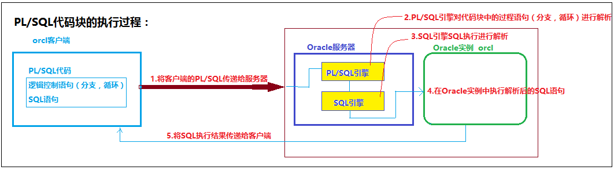
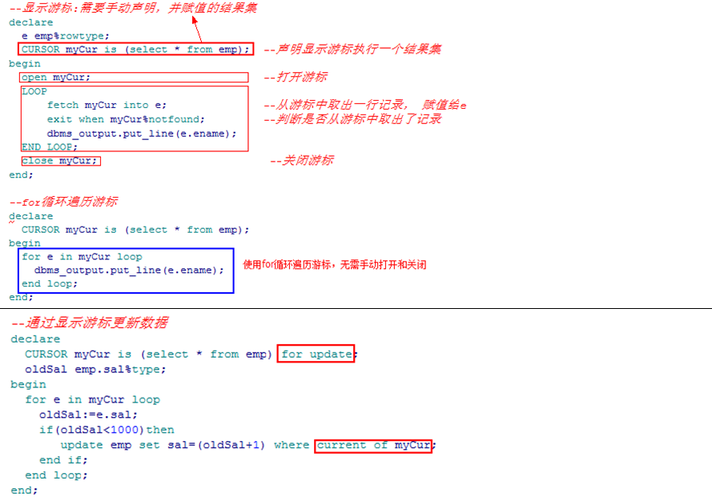

# PL/SQL代码块：

> PLSQL是过程语言和SQL的结合，在PLSQL中支持逻辑语句和SQL语句
>
> 可以通过PLSQL代码块创建存储过程、触发器、程序包等等

# PL/SQL代码块的执行过程：



# PL/SQL代码块的语法：


# PL/SQL代码库中的流程控制语句语法：


# PL/SQL数据类型：


## 异常处理：


# 存储过程

存储过程：就是带有名字的可供调用的存储在Oracle数据库实例中的PL/SQL代码块。

​     优点：

​          1.简化客户端的操作

​          2.减少网络资源开销

​          3.提高PL/SQL执行

​          4.提高客户端和Oracle实例交互的安全性

## 存储过程的定义语法：


# 触发器

触发器是一个无需调用、当特定事件发生会自动执行的存储在Oracle实例中的PL/SQL代码块

## 创建语法：


## :NEW和:OLD


## 行级触发器和语句级触发器


## 禁用/启用触发器


# 游标

在Oracle的存储过程/函数中

## 隐式游标


##  显式游标  



# ref游标


# 函数

```sql
--函数：特殊的存储过程（除了参数以外还有返回值）

--系统函数
--ascii()：获取指定字符的ascii码

--PL/SQL代码块中调用函数
declare
  m integer;
begin
  m:=ascii('S');
  DBMS_OUTPUT.put_line(m);
end;
--通过dual系统表调用函数
select ascii('S') from dual;
--chr():根据指定的ascii获取对应的字符
select chr(83) from dual;
--CONCAT('',''):字符串拼接
select concat('aaa','bbb') from dual;
--initcap('字符串'):将指定字符串首字母转换成大写
select initcap('ergouzi') from dual;
--instr(c1,c2,i,j):从c1的i的位置开始，查询c2第j次出现的位置
select instr('softeem','e',1,2) from dual; 
--to_date(c1,fmt)
--to_char(date,fmt)


--自定义函数
create or replace function fun_test1(minsal int,maxsal int,m out int)
return number
as
  c number;
begin
  select count(*) into c from emp where sal between minsal and maxsal;
  select max(sal) into m from emp;
  return c;
end;
--调用自定义函数
select fun_test1(1000,3000) from dual;

declare
  a int;
  b int;
begin
  b:=fun_test1(1000,2000,a);
  DBMS_OUTPUT.put_line(a);
  DBMS_OUTPUT.put_line(b);
end;
```

