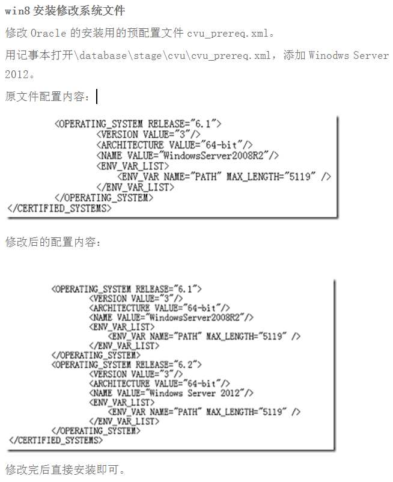
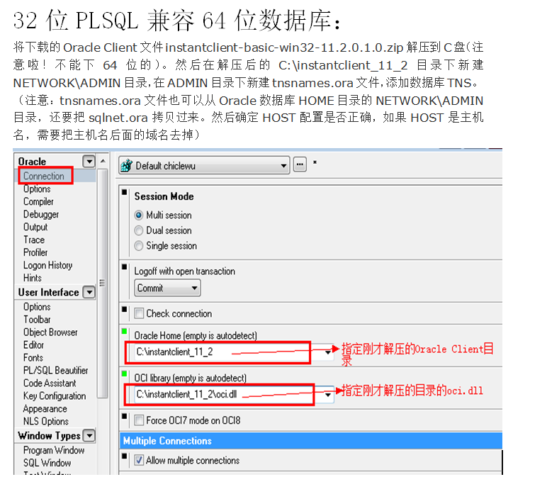

客户端乱码：
解决方法：

1. 先查询Oracle所用的编码

select userenv('language') from baial;  

2. 设置PLSQL 的所用编码为第1步查询得到的编码格式

新建一个环境变量：  NLS_LANG 对应查出来的编码

```EDOCTOR =
(DESCRIPTION =
    (ADDRESS_LIST =
      (ADDRESS = (PROTOCOL = TCP)(HOST = 39.98.48.207 )(PORT = 1525))
    )
    (CONNECT_DATA =
      (SERVICE_NAME = EDOCTOR )
    )
)
```