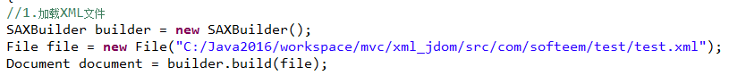
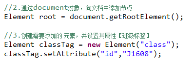
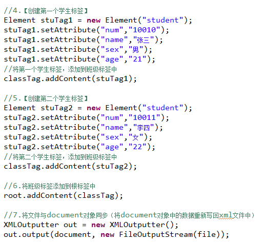
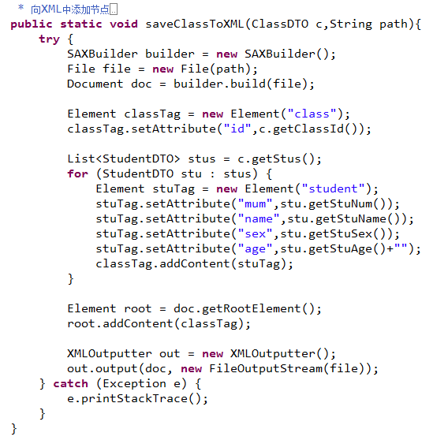
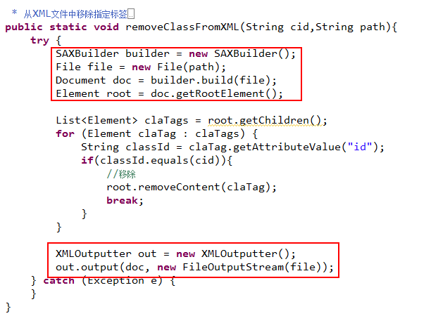
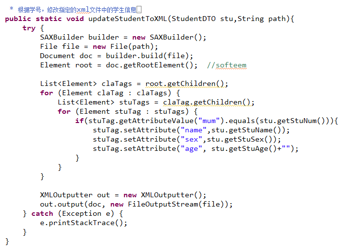
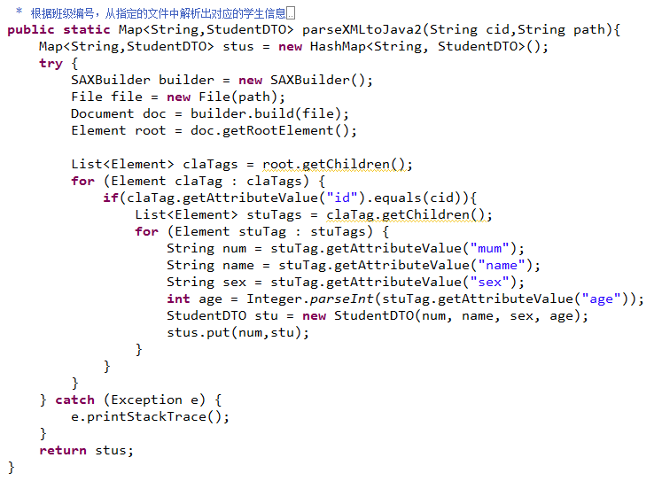
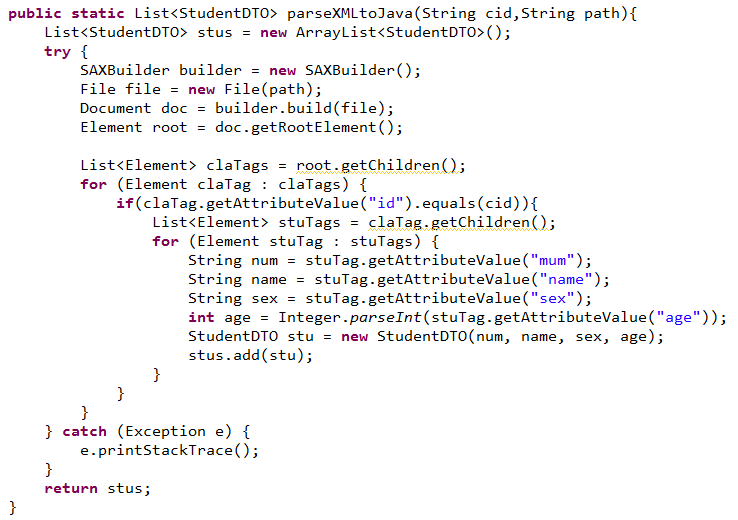
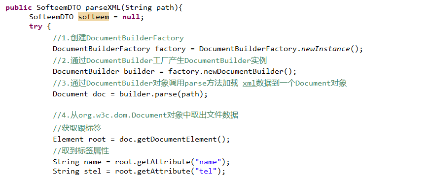
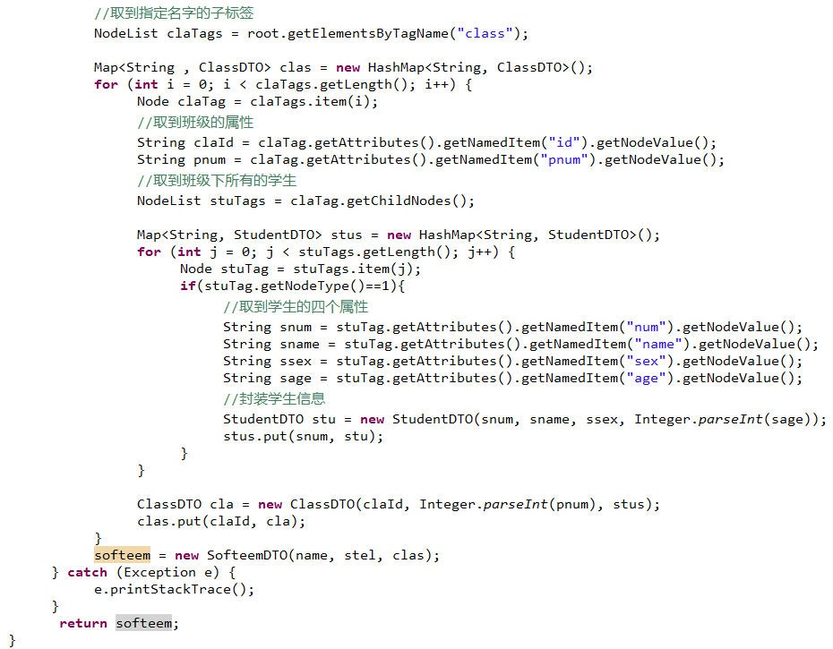

# XML介绍

XML是一种标记语言。

XML文件可以有结构的存储数据。

XML文档规则：

- 无效文档，没有遵守 XML 规范定义的语法规则；

- 有效文档，遵守了XML的语法规则，但是同时被DTD或者xsd规范约束；

- 结构良好的文档，遵守XML语法规范，没有DTD或者XSD限制。

XML文件语法规则：

> 1.在xml文件第一行声明版本及编码：<?xml version=*"1.0"* encoding=*"UTF-8"*?>
>
> 2.XML文档有且只有一对根标签
>
> 3.元素是区分大小写的
>
> 4.元素不能重叠
>
> 5.必须有结束标记
>
> 6.属性取值要加引号

#          文档对象模型（DOM规范）  

XML文件遵守树型结构。

# Java代码操作XML文档

- 将Java中的对象，保存到XML文件中

- XML文件解析，将XML文件中的数据，读取Java程序中

## jdom操作XML文件（增删改查节点）

- 添加元素：









- 移除元素



- 修改元素



- 解析





## DOM解析（无需导包，直接使用JDK中提供的类和接口）





## dom4j解析（SAX解析）

```java
public static SofteemDTO parseXML(String path){
		SofteemDTO softeem = null;
		try {
			SAXReader reader = new SAXReader();
			Document doc = reader.read(path);
			Element root = doc.getRootElement();
			
			String softeemName = root.attributeValue("name");
			String softeemTel = root.attributeValue("tel");
			
			List<Element> classTags = root.elements();
			Map<String, ClassDTO> classes = new HashMap<String, ClassDTO>();
			for(Element classTag : classTags){
				String cid = classTag.attributeValue("id");
				String pnum = classTag.attributeValue("pnum");
				
				List<Element> stuTags = classTag.elements("student");
				Map<String, StudentDTO> stus = new HashMap<String, StudentDTO>();
				for(Element stuTag : stuTags){
					String snum = stuTag.attributeValue("num");
					String sname = stuTag.attributeValue("name");
					String ssex = stuTag.attributeValue("sex");
					int sage = Integer.parseInt(stuTag.attributeValue("age"));
					StudentDTO student = new StudentDTO(snum, sname, ssex, sage);
					stus.put(snum, student);
				}
				ClassDTO cla = new ClassDTO(cid, pnum, stus);
				classes.put(cid, cla);
			}
			softeem = new SofteemDTO(softeemName, softeemTel, classes);
			
			
		} catch (DocumentException e) {
			e.printStackTrace();
		}
		
		return softeem;
}
```

