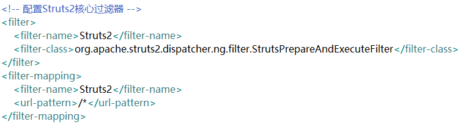
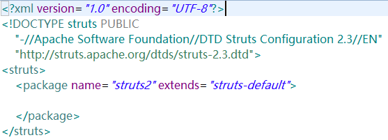
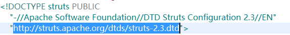
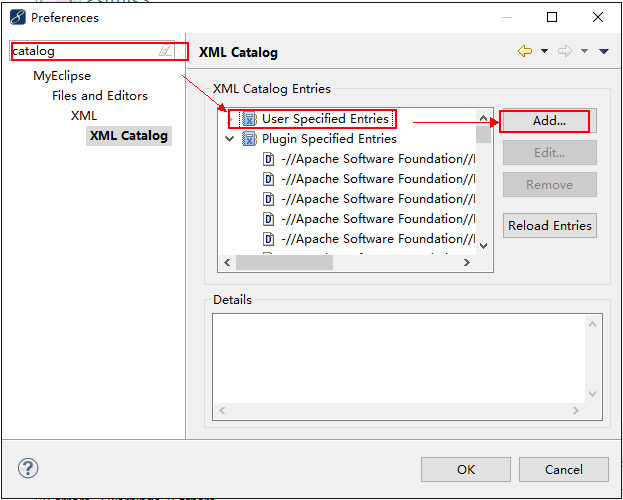
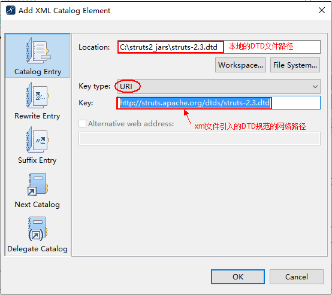
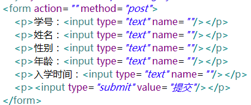
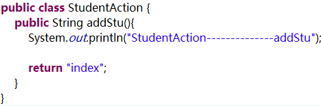
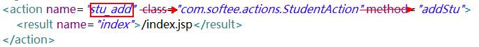

# 框架

框架，就是已经封装好的，可以实现特定功能的代码（Jar包）。

框架的作用：简化开发。

Struts2/Spring-MVC：MVC框架【页面-->struts2-->代码】

Hibernate：ORM框架【对象ßhibernateà数据表】

Spring：？？？？

# Struts2框架介绍

1.Struts2是阿帕奇的开源项目。（struts.apache.org）

2.Struts2是基于Struts1和webwork的合并，以拦截器机制为核心的MVC框架。

3.Struts2框架可以完成试图层与模型层的数据交互。

# Struts2执行流程

从客户端发送过来的请求，首先会经过前端控制器（核心控制器StrutsPrepareAndExecuteFilter），过滤器中会执行一组拦截器，然后执行Action，Action会有一个视图返回，然后根据result的配置进行页面跳转。

# 前端控制器

 在传统的开发中，每一个请求都会对应一个servlet，这样就会导致servlet繁多，而Struts2会将所有的请求都经过一个前端控制器，前端控制器会实现框架的部分功能（过滤器会拦截所有请求），然后把剩下的交给Action去处理。

# 拦截器

在AOP中用于某一个方法被访问之前进行拦截，或者在请求处理之后加入某些操作，拦截器是AOP的一种实现策略。

 

# 拦截器实现原理

​     拦截器是通过代理方法调用的，Struts2拦截器的实现相对简单，当请求到达Struts2的ServletDispatcher时，Struts2会去查配置文件，并根据配置文件实例化相对的拦截器对象，然后串成一个列表，最后一个个调用。

​     Struts2拦截器是可以插拔的，拦截器是AOP的一种实现，Struts2拦截器是将拦截器按一定的顺序联结成链，在访问被拦截的方法或字段时，Struts2按顺序执行。

# Struts2框架部署

将Struts2框架引入到项目中。

1.下载对应版本的Struts2框架资源（jar包，API文档，源码，项目示例）

2.创建一个web项目

3.将Struts2的jar包导入到创建好的web项目中

4.在web项目的web.xml中，配置Struts2的核心过滤器，让Struts2处理用户请求。

5.创建Struts2的核心配置文件:struts.xml

- 在web项目的src中新建一个xml文件，文件名为struts.xml
- 在struts.xml文件中引入Struts2配置文件的规则：在Struts2的核心包的最后面，有XML文档的dtd规范，打开之后将30-32行拷贝到创建好的struts.xml文件中
- 在struts.xml中添加根标签（struts），在跟标签中创建一个package标签并给出name属性，同时继承“struts-default”包：

# 在XML文件中设置自动提示

由于在xml文件中引入的规则如下：

DTD文档路径是一个网址，所以在没有接入互联网的情况下，就不会进行提示，所以要想有提示，只需将这个网址和本地的DTD文件进行关联即可：

1.解压Struts2的核心jar包，将struts-2.3.dtd文件存储到磁盘目录（c:/struts2_jars）

2.拷贝xml文件中引入的DTD规范的网址：“http://struts.apache.org/dtds/struts-2.3.dtd”

3.window---->perferences---->搜索“catalog”,弹出如下窗口：

4.点击“Add”之后，在窗口中进行如下配置

# Struts2使用示例（步骤）：将页面数据提交到Java类

1.创建一个JSP页面，设计传递数据的表单

2.在名为“com.softeem.actions”的包中创建一个StudentAction类，并在类中定义一个无参数有String类型返回值的方法：

3.在struts.xml文件中为创建好的StudentAction类进行配置

 

1.将**mvc.jar**及其依赖的jar包导入到项目中

2.在web.xml中配置mvc.jar中的过滤器，拦截所有请求

3.在src中创建一个mvc.xml文件【配置文件】

​                          