# i18n国际化

internationalization
## 1.什么是国际化？
​	同一个网站/网页可以支持不同的语言（支持切换）。

## 2.国际化实现原理？

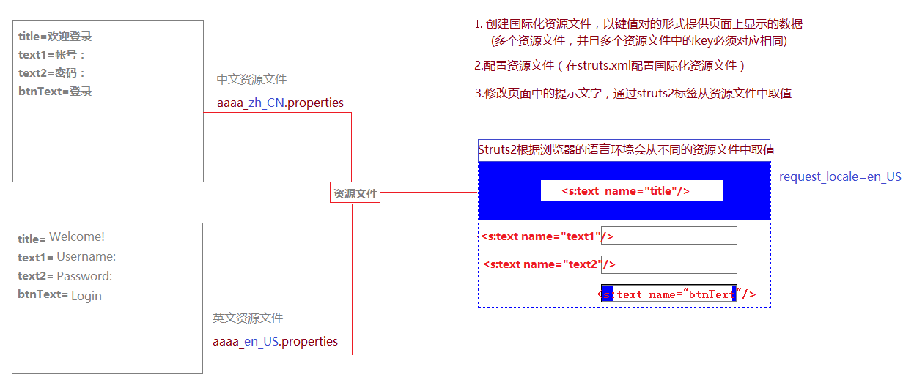

## 3.国际化实现：
​	a.创建资源文件
​		•资源文件就是后缀名为properties的键值对文件
​		•资源文件可以创建在src或者某一个package中(以创建在src中为例)

​	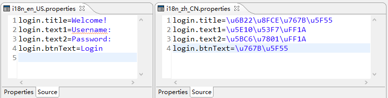

​	b.在struts.xml中配置自定义资源文件

​	

​	c.在页面中通过<s:text name=””/>显示指定文本

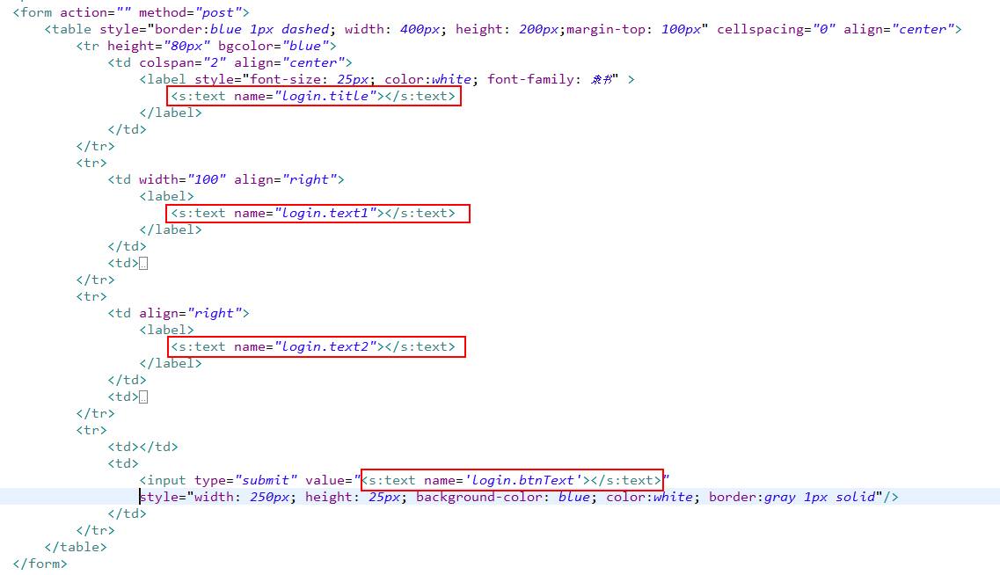

​	d.通过点击页面的连接来切换语言环境。

​     浏览器中的语言环境是通过request_locale来进行设置的

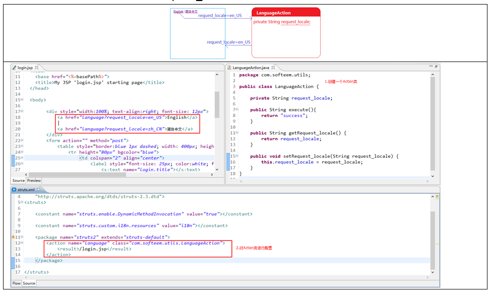

## 4.资源文件的级别

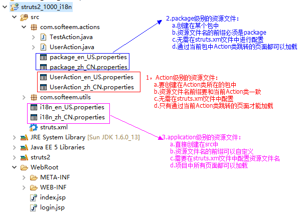

# 自定义数据类型转换

## 	1.创建自定义日期类型转换类

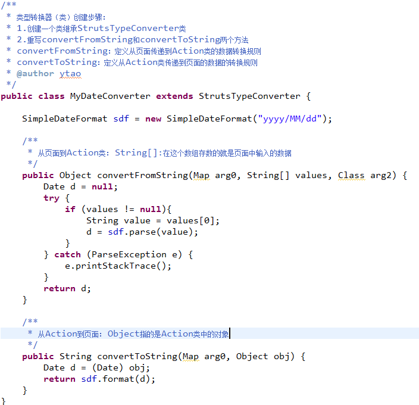

## 2.通过转换器配置文件设置转换器的使用场合

​          **xwork-convertion.properties:**

​          **java.util.Date=****com.softeem.utils.MyDateConverter**

> 类型转换类的三种配置形式：
>
> ​     *actin级别：
>
> ​      配置文件的名字：action-conversion.properties
>
> ​      内部配置：ation对应的属性名=转换类的路径
>
> ​      配置文件的存放位置：和action位置相同
>
> ​      说明：当用户访问这个action中这个属性的时候才调用类型转换类
>
>  
>
> ​     *pojo/dto级别：
>
> ​      配置文件的名字：pojo-conversion.properties
>
> ​      配置文件的存放位置：和pojo的位置相同
>
> ​      内部配置：pojo对应的属性名=类型转换类的路径
>
> ​      说明：当用户访问任何action，只要提交了这个pojo中的这个属性的时候就会调用类型转换类
>
>  
>
> ​     *src级别：
>
> ​      配置文件的名字：xwork-conversion.properties
>
> ​      配置文件的存放位置：直接存放在src下
>
> ​      内部配置：属性类型（+包名）=类型转换类的路径
>
> ​      说明：用户访问任何，只要提交了对应类型的属性的时候就会调用类型转换类

# Struts2数据检验

当数据从页面提交到Action类的时候，我们在进入Action类的方法之前，可以通过Struts2框架对其进行合法性检查。
使用Struts2框架进行数据校验有2中实现方式：

## 手动验证：

> 1.让Action类继承ActionSupport，并重写validate方法
>
> 2.在validate方法中进行验证，一旦出现数据格式不合法，则调用addFiledError(key,value)将错误提示信息添加到错误堆栈。
>
> 3.在validate方法最后面，必须通过super.validate()调用父类中的validate方法：父类中的validate方法会检查错误堆栈，一旦发现错误信息，则停止访问Action中的方法，跳转到name=”input”的result配置的页面，并且将错误信息传递过去。
>
> 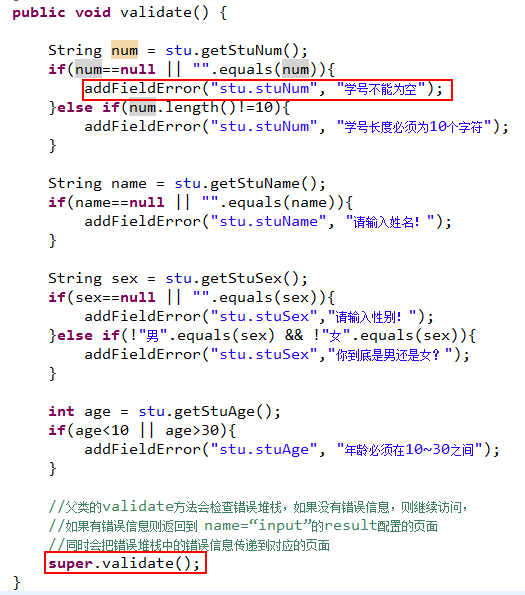
>
> 4.在input对应的页面，从值栈中的错误堆栈中，取出错误提示信息
>
> 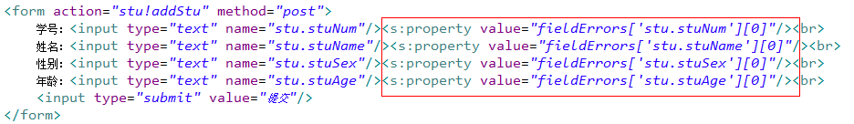

## 自动验证：

1.Action类继承ActionSupport类

2.在Action类所在的包中，创建一个名为“Action类名-validation.xml”文件（验证配置文件）

3.在创建好的xml中引入”验证配置文件”的配置规则（xwork的jar包中找）

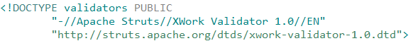

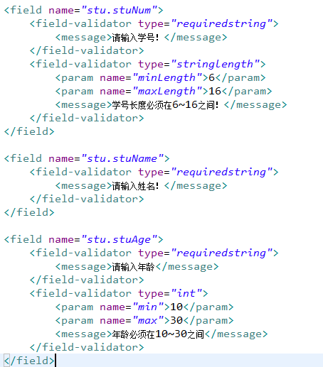

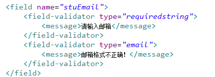

4.在验证配置文件中进行验证规则配置

# Struts2提供的默认验证器：

```xml
<validators>
    <validator name="required" class="com.opensymphony.xwork2.validator.validators.RequiredFieldValidator"/>
    <validator name="requiredstring" class="com.opensymphony.xwork2.validator.validators.RequiredStringValidator"/>
    <validator name="int" class="com.opensymphony.xwork2.validator.validators.IntRangeFieldValidator"/>
    <validator name="long" class="com.opensymphony.xwork2.validator.validators.LongRangeFieldValidator"/>
    <validator name="short" class="com.opensymphony.xwork2.validator.validators.ShortRangeFieldValidator"/>
    <validator name="double" class="com.opensymphony.xwork2.validator.validators.DoubleRangeFieldValidator"/>
    <validator name="date" class="com.opensymphony.xwork2.validator.validators.DateRangeFieldValidator"/>
    <validator name="expression" class="com.opensymphony.xwork2.validator.validators.ExpressionValidator"/>
    <validator name="fieldexpression" class="com.opensymphony.xwork2.validator.validators.FieldExpressionValidator"/>
    <validator name="email" class="com.opensymphony.xwork2.validator.validators.EmailValidator"/>
    <validator name="url" class="com.opensymphony.xwork2.validator.validators.URLValidator"/>
    <validator name="visitor" class="com.opensymphony.xwork2.validator.validators.VisitorFieldValidator"/>
    <validator name="conversion" class="com.opensymphony.xwork2.validator.validators.ConversionErrorFieldValidator"/>
    <validator name="stringlength" class="com.opensymphony.xwork2.validator.validators.StringLengthFieldValidator"/>
    <validator name="regex" class="com.opensymphony.xwork2.validator.validators.RegexFieldValidator"/>
    <validator name="conditionalvisitor" class="com.opensymphony.xwork2.validator.validators.ConditionalVisitorFieldValidator"/>
</validators>
```

# **自定义验证器：**

①创建验证器类继承FieldValidatorSupport，如果需要参数，则给出对应的属性，提供set方法

②重写validate方法，先获取到验证字段名，然后根据验证字段名获取到验证字段值，一旦出现能满足验证条件的情况就将错误信息添加到错误堆栈：

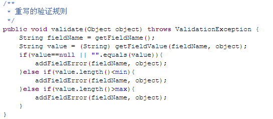

③在src下创建验证器配置文件：validator.xml，并对自定义验证器进行配置：

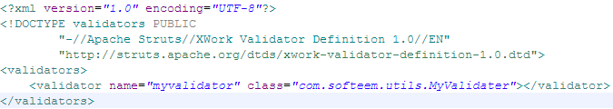

④使用自己的验证器

# 文件上传和下载

## 文件上传：

​     1.页面表表单数据提交方式为post,

​     2.表单添加属性：enctype=*"multipart/form-data"*

​     3.在Action类中定义一个File类型的变量（用于接收页面提交的文件），提供get/set方法

​     4.修改页面表单中file控件的name属性与Action类中File类型变量名一致。

## 文件下载：

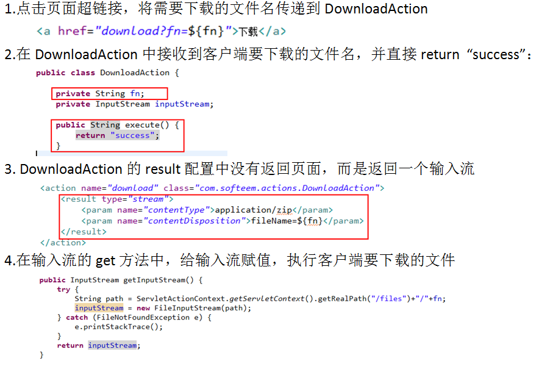

