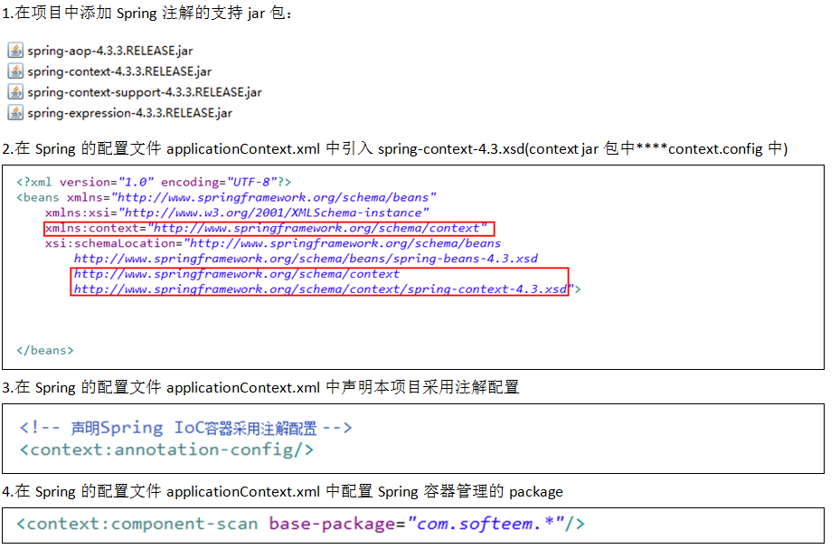
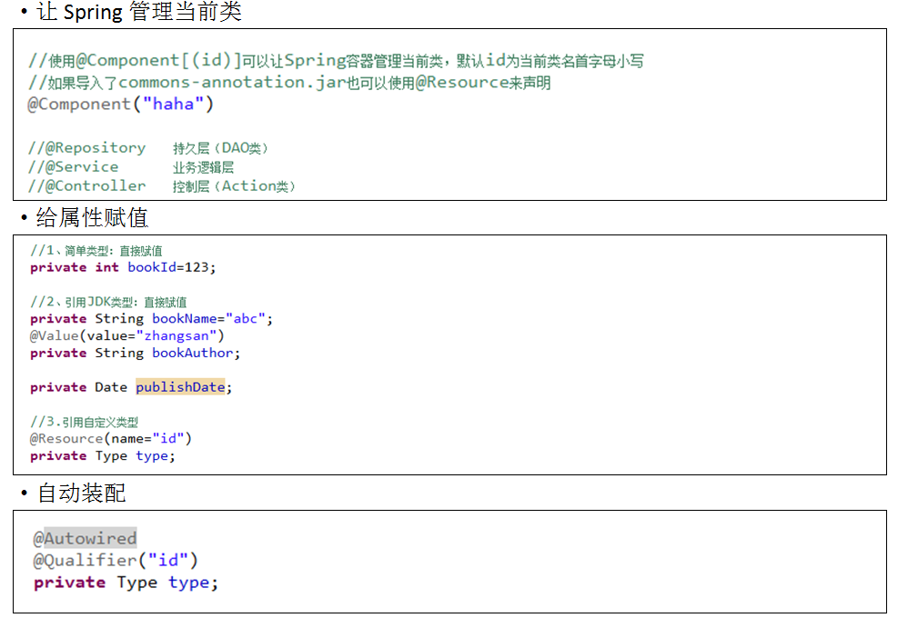
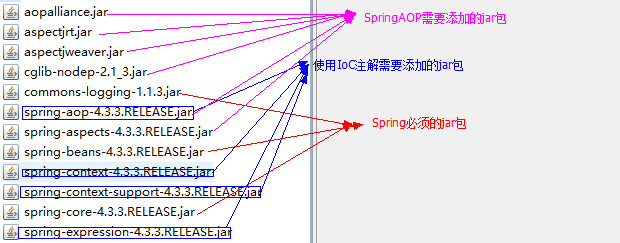
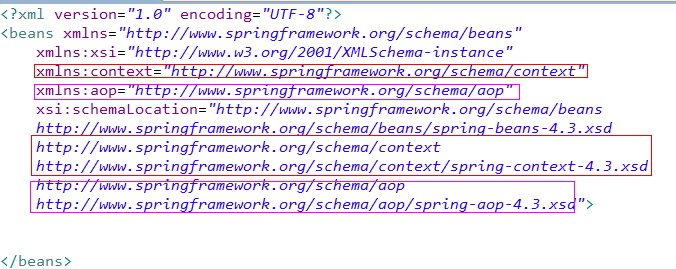
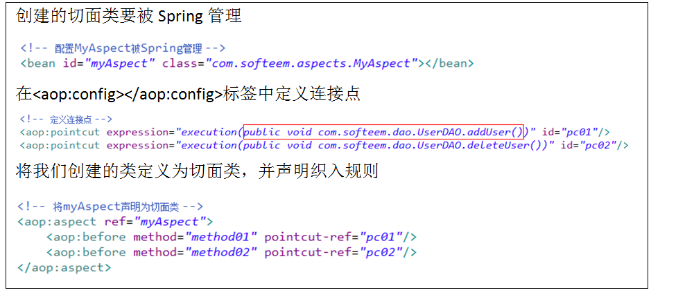
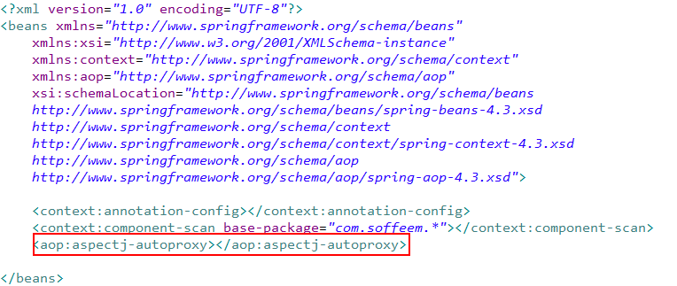
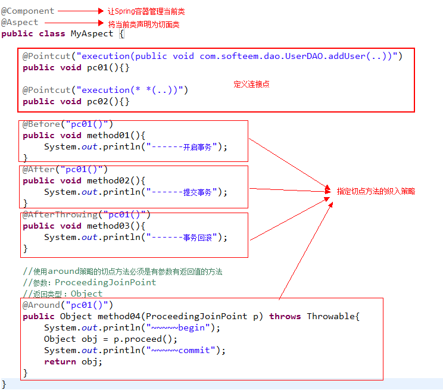

# IoC-xml复习

通过Spring容器可以完成类的管理、创建对象及属性赋值。

# IoC-注解配置

注解：指的是在类中通过“@keyword”来向spring容器传达配置信息。

步骤：

# AOP

**Aspect Orentied Progamming：**
连接点：方法
切入点：连接点两端
切点：方法（被添加到切入点的方法）
织入：将切点配置到切入点的过程（动作）
切面：定义切点方法的类
面向切面编程：在切面类中定义织入的方法，然后通过Spring配置可以添加到指定的连接点方法的两端。

## AOP 的实现方式有哪几种？如何选择？（必考）

JDK 动态代理实现和 cglib 实现。

**选择：**

1. 如果目标对象实现了接口，默认情况下会采用 JDK 的动态代理实现 AOP，也可以强制使用 cglib 实现 AOP；
2. 如果目标对象没有实现接口，必须采用 cglib 库，Spring 会自动在 JDK 动态代理和 cglib 之间转换。

## 扩展：JDK 动态代理如何实现？（加分点）

JDK 动态代理，只能对实现了接口的类生成代理，而不是针对类，该目标类型实现的接口都将被代理。

原理是通过在运行期间创建一个接口的实现类来完成对目标对象的代理。

1. 定义一个实现接口     InvocationHandler 的类；
2. 通过构造函数，注入被代理类；
3. 实现 invoke（ Object proxy, Method method, Object[] args）方法；
4. 在主函数中获得被代理类的类加载器；
5. 使用     Proxy.newProxyInstance( ) 产生一个代理对象；
6. 通过代理对象调用各种方法。

# AOP使用步骤（xml配置）

1.创建项目

2.在项目中导入Spring需要的jar包

3.创建配置文件applicationContext.xml,并完成xsd模式引入（包括beans,context,aop）

4.创建一个切面类，在类中定义需要添加的方法

5.在applicationContext.xml中进行AOP配置

# aop注解配置

1.在Spring配置文件中声明使用注解配置

2.创建一个切面类并完成配置

