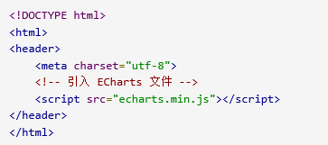
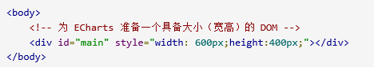
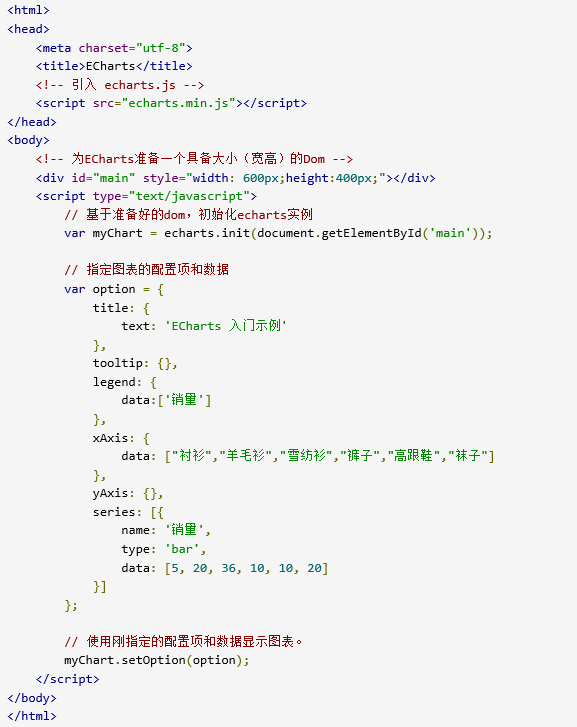
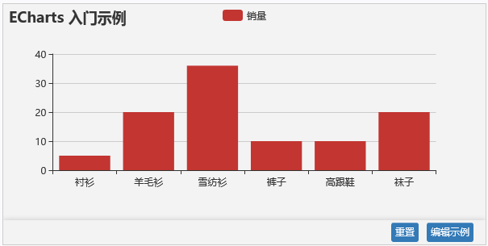
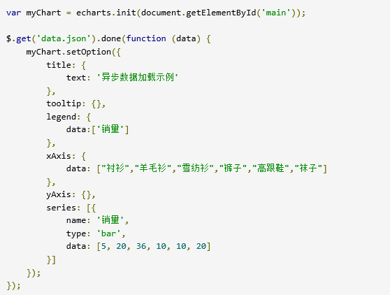
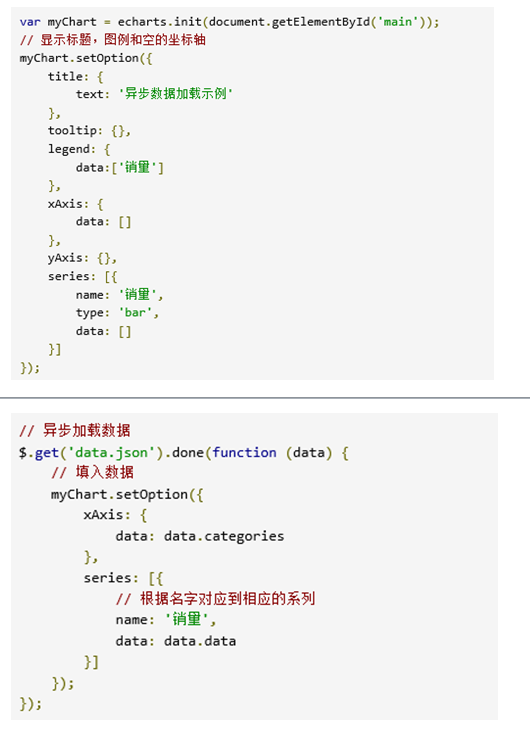
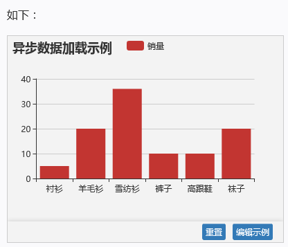
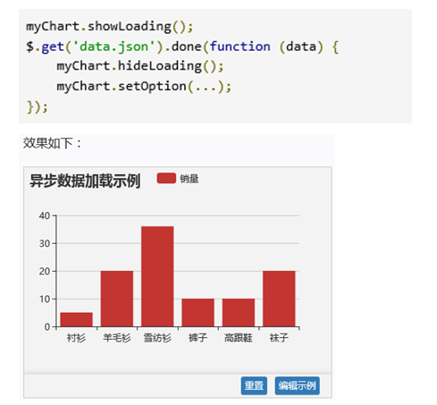
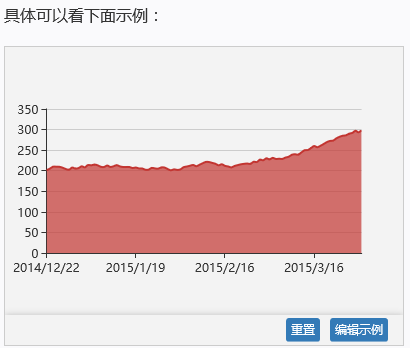

# **获取** **ECharts**

你可以通过以下几种方式获取 ECharts。

1. 从[官网下载界面](http://echarts.baidu.com/download.html)选择你需要的版本下载，根据开发者功能和体积上的需求，我们提供了不同打包的下载，如果你在体积上没有要求，可以直接下载[完整版本](http://echarts.baidu.com/dist/echarts.min.js)。开发环境建议下载[源代码版本](http://echarts.baidu.com/dist/echarts.js)，包含了常见的错误提示和警告。
2. 在 ECharts 的 [GitHub](https://github.com/echarts) 上下载最新的 release 版本，解压出来的文件夹里的 dist 目录里可以找到最新版本的 echarts 库。
3. 通过 npm 获取 echarts，npm install echarts --save，详见“[在 webpack 中使用 echarts](http://echarts.baidu.com/tutorial.html#在 webpack 中使用 ECharts)”
4. cdn 引入，你可以在 [cdnjs](https://cdnjs.com/libraries/echarts)，[npmcdn](https://npmcdn.com/echarts@latest/dist/)     或者国内的 [bootcdn](http://www.bootcdn.cn/echarts/) 上找到 ECharts 的最新版本。

# **引入** **ECharts**

   ECharts 3 开始不再强制使用 AMD 的方式按需引入，代码里也不再内置 AMD 加载器。因此引入方式简单了很多，只需要像普通的 JavaScript 库一样用 script 标签引入。

# **绘制一个简单的图表**

在绘图前我们需要为 ECharts 准备一个具备高宽的 DOM 容器。

然后就可以通过 echarts.init 方法初始化一个 echarts 实例并通过 setOption 方法生成一个简单的柱状图，下面是完整代码。

这样你的第一个图表就诞生了！

# 异步数据加载和更新

**异步加载**

​         [入门示例](http://echarts.baidu.com/tutorial.html#getting-started)中的数据是在初始化后setOption中直接填入的，但是很多时候可能数据需要异步加载后再填入。ECharts 中实现异步数据的更新非常简单，在图表初始化后不管任何时候只要通过 jQuery 等工具异步获取数据后通过 setOption 填入数据和配置项就行。  

或者先设置完其它的样式，显示一个空的直角坐标轴，然后获取数据后填入数据。

  

  ECharts 中在更新数据的时候需要通过name属性对应到相应的系列，上面示例中如果name不存在也可以根据系列的顺序正常更新，但是更多时候推荐更新数据的时候加上系列的name数据。

# **loading** **动画**

如果数据加载时间较长，一个空的坐标轴放在画布上也会让用户觉得是不是产生 bug 了，因此需要一个 loading 的动画来提示用户数据正在加载。

​    ECharts 默认有提供了一个简单的加载动画。只需要调用 [showLoading](http://echarts.baidu.com/api.html#echartsInstance.showLoading) 方法显示。数据加载完成后再调用 [hideLoading](http://echarts.baidu.com/api.html#echartsInstance.hideLoading) 方法隐藏加载动画。

# 数据的动态更新

​    ECharts 由数据驱动，数据的改变驱动图表展现的改变，因此动态数据的实现也变得异常简单。

​    所有数据的更新都通过 [setOption](http://echarts.baidu.com/tutorial.html#api.html#echartsInstance.setOption)实现，你只需要定时获取数据，[setOption](http://echarts.baidu.com/tutorial.html#api.html#echartsInstance.setOption) 填入数据，而不用考虑数据到底产生了那些变化，ECharts 会找到两组数据之间的差异然后通过合适的动画去表现数据的变化。

